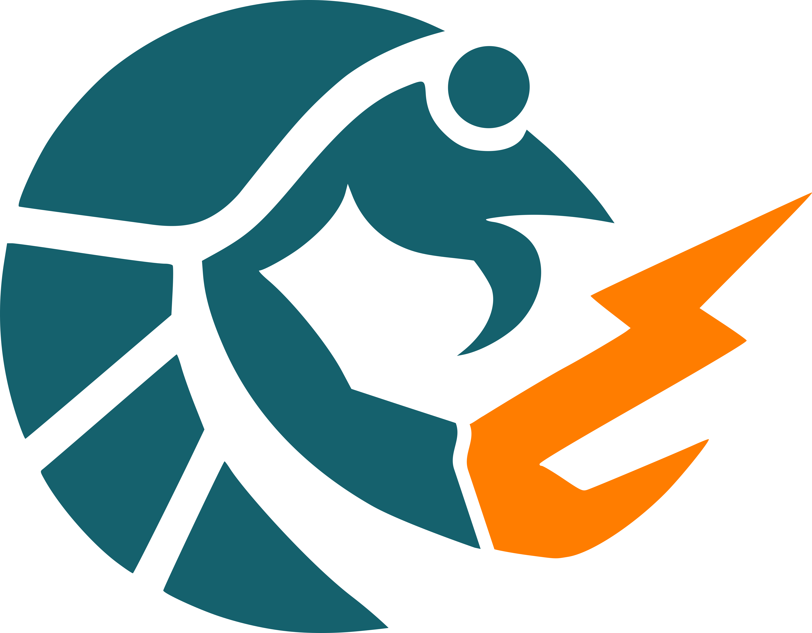

<p align="center">
  <picture>
    <source media="(prefers-color-scheme: dark)" srcset="assets/hull-lockup-on-dark.svg">
    
  </picture>
</p>

Run unikernels and sandboxed Linux containers on macOS with Apple Silicon,
using the same OCI images and workflows as Linux.

hull is the microVM runtime [brig](https://github.com/brig-sh/brig) drives on
macOS, and it is useful on its own: it boots an OCI image as a real VM through
Virtualization.framework, with a QEMU backend as an alternative.

Requires Apple Silicon (M1-M5). **macOS 26 (Tahoe) is the recommended
platform and the only one we test on**; the Swift runner is built for macOS
14+, so earlier releases may well work, and the install does not block them.
If you run one, tell us how it went.

## Install

### Homebrew

```bash
brew tap brig-sh/brig
brew trust brig-sh/brig   # brew refuses untrusted third-party taps
brew install --cask hull
```

Installing brig brings hull with it, since brig depends on it -- so
`brew install --cask brig` is the other way in.

The cask lands in the tap with hull's first stable release; until then, build
from source as described below. It installs `hull` and `vz-runner` side by
side (the CLI discovers the runner next to its own executable) and pulls in
`e2fsprogs`
for block-rootfs mode. The [QEMU](https://www.qemu.org/) backend stays
optional: `brew install qemu`.

Check it works:

```bash
hull --help
```

## Quick start

### Using Bunny (recommended)

[Bunny](https://github.com/nubificus/bunny) is a BuildKit frontend that
automatically packages any Dockerfile as a bootable unikernel image. It
bundles a Linux kernel and the `urunit` init process alongside your container
filesystem.

```dockerfile
#syntax=harbor.nbfc.io/nubificus/bunny:latest
FROM ubuntu:24.04
RUN apt-get update && apt-get install -y nginx
CMD ["nginx", "-g", "daemon off;"]
```

```bash
# Build and push
docker build -t ttl.sh/my-nginx:1h .
docker push ttl.sh/my-nginx:1h

# Run with Virtualization.framework
hull run --hypervisor vz --mem 512 --cpus 2 --net shared ttl.sh/my-nginx:1h

# Run with QEMU
hull run --hypervisor qemu --mem 512 --cpus 2 --net shared ttl.sh/my-nginx:1h
```

### Instance Management

```bash
# Run detached
ID=$(hull run -d --hypervisor vz --net shared ttl.sh/my-nginx:1h)

# List instances
hull ps

# View logs
hull logs $ID
hull logs -f $ID   # follow

# Stop and remove
hull stop $ID
hull rm $ID
```

## Supported backends

hull supports two VMM backends:

| Backend | Technology | Network | Rootfs Modes | Boot Time |
|---------|-----------|---------|--------------|-----------|
| **Vz** | Apple Virtualization.framework | VZNATNetworkDeviceAttachment | virtiofs, ext4 block | ~60 ms |
| **QEMU** | QEMU + HVF acceleration | vmnet-shared | 9pfs, ext4 block | ~73 ms |

Both backends use hardware-accelerated virtualization (Apple Hypervisor Framework)
and boot ARM64 Linux kernels with near-native performance.

A `compose` subcommand runs multi-service projects from a docker-compose
subset ([`docs/compose.md`](docs/compose.md)). How much of the compose spec is
covered — with per-capability status, divergences, and security tradeoffs —
is measured continuously and published in

## Building from source

Only needed to work on hull itself — to *use* it, install from the tap
above.

### Requirements

- Apple Silicon (M1/M2/M3/M4/M5). macOS 26 (Tahoe) recommended and tested; the runner targets macOS 14+
- Go 1.26+ (see `go.mod`)
- Xcode Command Line Tools (includes Swift 5.9+)

### System Configuration

The Vz backend needs the `com.apple.security.virtualization` entitlement. How
you get that entitlement honored depends on how the binary is signed:

- **Signed with a real Apple identity (recommended)** — an *Apple Development*
  or *Developer ID Application* certificate. AMFI honors the entitlement with
  **SIP enabled**; no boot-arg changes are needed. This is the supported path
  (see [Signing](#signing)). Vz **NAT networking** (`--net shared`) works
  with just this entitlement — `com.apple.vm.networking` is **not** required for
  NAT; it is only needed for *bridged* mode or QEMU's `vmnet` backend.
- **Ad-hoc signed (`codesign --sign -`)** — the entitlement is only honored when
  AMFI is disabled. This is a fallback for when you have no signing identity:

  ```bash
  # 1. Disable SIP: boot into Recovery Mode (hold Power button at startup),
  #    open Terminal, run: csrutil disable
  # 2. Set AMFI boot arg (from normal macOS):
  sudo nvram boot-args="amfi_get_out_of_my_way=1"
  # 3. Reboot
  ```

### The urunc dependency

This module consumes [urunc](https://github.com/urunc-dev/urunc) as a Go
dependency. Until darwin support is merged upstream, `go.mod` replaces it with
the NOFireAI fork pinned at a pseudo-version of the `darwin-integration`
branch:

```
replace github.com/urunc-dev/urunc => github.com/nofireai/urunc v0.0.0-<date>-<sha>
```

**When `darwin-integration` moves**, refresh the pin:

```bash
PV=$(go list -m github.com/nofireai/urunc@darwin-integration | awk '{print $2}')
go mod edit -replace=github.com/urunc-dev/urunc=github.com/nofireai/urunc@"$PV"
go mod tidy
```

**For local development** against a live fork checkout, use an uncommitted
`go.work` (gitignored) instead of editing `go.mod`:

```
go 1.26.4

use (
	.
	/path/to/urunc   # checkout on darwin-integration
)
```

Once darwin support lands upstream, drop the `replace` and require a released
`github.com/urunc-dev/urunc` version.

### The app bundle and installer

`make app` wraps both binaries into `hull.app` (urunc CNCF mark as the
app icon; vz-runner rides inside `Contents/MacOS`, so sibling discovery
works from `/Applications`). `make dmg` produces the drag-to-Applications
installer: styled background, NOFire volume icon, `/Applications` drop link,
signed + notarized + stapled. After dragging to Applications, put the CLI on
your PATH with:

```bash
ln -s /Applications/hull.app/Contents/MacOS/hull ~/.local/bin/hull
```

Packaging assets live in `packaging/` and are regenerated from the vendored
logo sources with `scripts/make-packaging-assets.sh` (needs imagemagick).

### Release signing (CI)

Regular CI (`.github/workflows/ci.yml`) lints and builds with ad-hoc
signatures only. Distributable builds come from the manually-invoked
**Sign and Notarize** workflow (`.github/workflows/sign-notarize.yml`):

```bash
gh workflow run sign-notarize.yml
```

It needs five repository secrets:

| Secret | Content | How to produce |
|--------|---------|----------------|
| `MACOS_CERT_P12` | base64 of the Developer ID Application `.p12` (cert + private key) | `base64 -i DeveloperID.p12` — export from Keychain Access → My Certificates |
| `MACOS_CERT_PASSWORD` | password protecting the `.p12` | chosen at export time |
| `NOTARY_KEY_P8` | App Store Connect API private key, plain `.p8` contents | App Store Connect → Users and Access → Integrations → App Store Connect API |
| `NOTARY_KEY_ID` | the API key's ID | shown next to the key |
| `NOTARY_ISSUER_ID` | the issuer UUID | shown on the same page |

Set them with:

```bash
gh secret set MACOS_CERT_P12 --repo brig-sh/hull < cert.p12.b64
gh secret set MACOS_CERT_PASSWORD --repo brig-sh/hull
gh secret set NOTARY_KEY_P8 --repo brig-sh/hull < AuthKey_XXXX.p8
gh secret set NOTARY_KEY_ID --repo brig-sh/hull
gh secret set NOTARY_ISSUER_ID --repo brig-sh/hull
```

hull consists of three binaries:

| Binary | Language | Description |
|--------|----------|-------------|
| `hull` | Go | CLI for pulling OCI images and orchestrating VM lifecycle |
| `vz-runner` | Swift | Virtualization.framework backend (launches VZVirtualMachine) |
| `containerd-shim-urunc-v2` | Go | containerd shim (for containerd integration) |

### Prerequisites

```bash
brew install go qemu e2fsprogs
```

### Build All (quick)

```bash
# Build hull + vz-runner and sign both with your Apple signing identity.
# Find the identity name with: security find-identity -v -p codesigning
make macos CODESIGN_IDENTITY="Apple Development: Your Name (TEAMID)"

# Verify what got signed (authority chain + entitlements)
make codesign_verify

# Symlink into the current directory (vz-runner must sit next to hull)
ln -sf dist/hull_arm64 ./hull
ln -sf cmd/vz-runner/.build/arm64-apple-macosx/release/vz-runner ./vz-runner
```

Omit `CODESIGN_IDENTITY` to fall back to ad-hoc signing (`-`), which requires a
disabled AMFI (see [System Configuration](#system-configuration)).

<a name="signing-macos"></a>
### Signing

`make sign` (invoked by `make macos`) signs `vz-runner` with the
virtualization-only entitlements plist (`cmd/vz-runner/Entitlements-novmnet.plist`),
signs `hull`, and strips the quarantine attribute from both.

**Keychain prerequisite.** Signing with an Apple identity needs the full trust
chain in your keychain: your leaf certificate **plus** the *Apple Worldwide
Developer Relations* intermediate and the *Apple Root CA*. If `codesign` fails
with `unable to build chain to self-signed root` / `errSecInternalComponent`,
the intermediates are missing — install them once:

```bash
curl -fsSLO https://www.apple.com/certificateauthority/AppleWWDRCAG3.cer
curl -fsSLO https://www.apple.com/appleca/AppleIncRootCertificate.cer
security import AppleWWDRCAG3.cer -k ~/Library/Keychains/login.keychain-db
security import AppleIncRootCertificate.cer -k ~/Library/Keychains/login.keychain-db
security find-identity -v -p codesigning   # should now list a valid identity
```

**Quarantine ("Open Anyway" prompts).** If binaries were transferred via
AirDrop, a download, or file sharing, macOS tags them with
`com.apple.quarantine` and Gatekeeper prompts you to "Open Anyway". Locally
built binaries are not quarantined. `make sign` strips it; to do it by hand:

```bash
xattr -dr com.apple.quarantine ./hull ./vz-runner
```

An *Apple Development* certificate is enough for local use once quarantine is
stripped. To let **other** machines run the binaries without prompts, sign with
a **Developer ID Application** certificate and notarize (see
[Distribution](#distribution-notarization)).

Or build each component individually:

### 1. hull (Go CLI)

```bash
# Using make
make urunc_macos
# Output: dist/hull_arm64

# Or directly with go build
go build -o hull ./cmd/hull/
```

### 2. vz-runner (Swift — Virtualization.framework)

```bash
# Build release binary
cd cmd/vz-runner
swift build -c release
cd ../..

# The binary is at:
# cmd/vz-runner/.build/arm64-apple-macosx/release/vz-runner
```

**Important:** vz-runner must be re-signed with entitlements every time it is
built or copied. Without the entitlement, macOS rejects the virtualization API
at runtime. Prefer `make sign` (see [Signing](#signing)); to sign by hand:

```bash
codesign --force --options runtime \
  --sign "Apple Development: Your Name (TEAMID)" \
  --entitlements cmd/vz-runner/Entitlements-novmnet.plist \
  cmd/vz-runner/.build/arm64-apple-macosx/release/vz-runner
```

The default plist (`cmd/vz-runner/Entitlements-novmnet.plist`) contains only:
- `com.apple.security.virtualization` — required to create VZVirtualMachine

This is sufficient for the Vz backend, **including NAT networking**
(`VZNATNetworkDeviceAttachment`, `--net shared`). `com.apple.vm.networking` is
**not** needed for NAT; the older `Entitlements.plist` (which adds it) is only
relevant for bridged networking.

### 3. containerd-shim-urunc-v2 (Go — optional)

Only needed if integrating with containerd on macOS:

```bash
go build -o containerd-shim-urunc-v2 ./cmd/containerd-shim-urunc-v2/
```

### 4. QEMU

Install QEMU >= 7.2 (`brew install qemu`) — nothing else. Under compose
([`docs/compose.md`](docs/compose.md)) or any `run --gateway-sock ...`
invocation, QEMU networking goes through the
user-mode gateway over a unix-socket stream netdev: **no vmnet, no
`com.apple.vm.networking` entitlement, no root, no re-signed binary**, and
HVF acceleration works out of the box (`com.apple.security.hypervisor` is
not a restricted entitlement).

The legacy vmnet path below applies **only** to standalone
`run --hypervisor qemu --net shared` without a gateway; prefer the gateway.

<details>
<summary>Legacy: re-sign QEMU for direct vmnet networking</summary>

The Homebrew QEMU binary does not have the `com.apple.vm.networking`
entitlement, so vmnet-shared networking will fail. To fix this, copy and
re-sign the binary:

```bash
# Copy QEMU binary
cp $(which qemu-system-aarch64) /usr/local/bin/qemu-system-aarch64-signed

# Create entitlements and sign
codesign --force --sign - --entitlements <(cat <<'EOF'
<?xml version="1.0" encoding="UTF-8"?>
<!DOCTYPE plist PUBLIC "-//Apple//DTD PLIST 1.0//EN"
  "http://www.apple.com/DTDs/PropertyList-1.0.dtd">
<plist version="1.0"><dict>
  <key>com.apple.security.hypervisor</key><true/>
  <key>com.apple.vm.networking</key><true/>
</dict></plist>
EOF
) /usr/local/bin/qemu-system-aarch64-signed
```

Then configure urunc to use the signed binary (see [urunc configuration](#urunc-configuration)).

</details>

### Installation

Place the binaries where hull can find them. `vz-runner` must be in
the same directory as `hull` (it is located via `os.Executable()`):

```bash
# Option A: install to /usr/local/bin
sudo cp dist/hull_arm64 /usr/local/bin/hull
sudo cp cmd/vz-runner/.build/arm64-apple-macosx/release/vz-runner /usr/local/bin/vz-runner

# Re-sign vz-runner after copying (entitlements are stripped on copy)
sudo codesign --force --sign - \
  --entitlements cmd/vz-runner/Entitlements.plist \
  /usr/local/bin/vz-runner

# Option B: run from the build directory
ln -sf dist/hull_arm64 ./hull
ln -sf cmd/vz-runner/.build/arm64-apple-macosx/release/vz-runner ./vz-runner
```

### Verify Installation

```bash
# Check hull
./hull --help

# Check vz-runner entitlements
codesign -d --entitlements :- ./vz-runner 2>/dev/null | grep -c virtualization
# Should print: 1

# Check QEMU (if using QEMU backend)
qemu-system-aarch64 --version
```

### urunc Configuration

hull looks for the QEMU binary in a config file or uses the system
default. To point it at a signed QEMU binary, create `~/.hull/config.json`:

```json
{
  "monitors": {
    "qemu": {
      "path": "/usr/local/bin/qemu-system-aarch64-signed"
    }
  }
}
```

## VMM Backends

### Virtualization.framework (Vz)

The Vz backend uses Apple's native Virtualization.framework via a Swift helper
binary (`vz-runner`). It provides the best network throughput and tightest
macOS integration.

```bash
./hull run --hypervisor vz --mem 2048 --cpus 4 --net shared <image>
```

**How it works:**
- `hull` prepares the rootfs and kernel command line
- Launches `vz-runner` with `--kernel`, `--cmdline`, `--share` (virtiofs) or `--rootfs` (block)
- `vz-runner` creates a `VZVirtualMachine`, attaches serial console to stdin/stdout
- Guest kernel boots with `root=rootfs rootfstype=virtiofs` (virtiofs mode) or `root=/dev/vda` (block mode)

**Requirements:**
- `vz-runner` must be signed with the `com.apple.security.virtualization` entitlement (NAT networking needs nothing more; see [Signing](#signing))
- macOS 26+ (VZLinuxBootLoader requires ARM64 Image format kernel, not PE32+/EFI stub)

### QEMU + HVF

The QEMU backend uses `qemu-system-aarch64` with `-accel hvf` for
hardware-accelerated virtualization.

```bash
./hull run --hypervisor qemu --mem 2048 --cpus 4 --net shared <image>
```

**How it works:**
- `hull` builds the QEMU command line with HVF, vmnet-shared, and 9pfs/block device
- Guest kernel boots with `root=rootfs rootfstype=9p rootflags=trans=virtio,version=9p2000.L` (9pfs mode) or `root=/dev/vda` (block mode)

**Requirements:**
- `brew install qemu`
- For networking: QEMU binary must be signed with `com.apple.vm.networking` entitlement:
  ```bash
  cp $(which qemu-system-aarch64) /usr/local/bin/qemu-aarch64-signed
  codesign --force --sign - --entitlements <(cat <<EOF
  <?xml version="1.0" encoding="UTF-8"?>
  <!DOCTYPE plist PUBLIC "-//Apple//DTD PLIST 1.0//EN" "http://www.apple.com/DTDs/PropertyList-1.0.dtd">
  <plist version="1.0"><dict>
    <key>com.apple.security.hypervisor</key><true/>
    <key>com.apple.vm.networking</key><true/>
  </dict></plist>
  EOF
  ) /usr/local/bin/qemu-aarch64-signed
  ```

## Rootfs Modes

### virtiofs (Vz default)

The container rootfs directory is shared into the guest via virtiofs. An
overlayfs layer with a tmpfs upper dir is mounted on top to handle writes
and work around macOS virtiofs limitations (mode-000 files).

```bash
./hull run --hypervisor vz <image>
```

### 9pfs (QEMU default)

The container rootfs directory is shared via QEMU's built-in 9p filesystem
with `security_model=none`. No overlay needed.

```bash
./hull run --hypervisor qemu <image>
```

### ext4 block device

Creates an ext4 disk image from the container rootfs using `mke2fs -d` and
attaches it as a virtio block device. This provides a native POSIX filesystem
without the limitations of virtiofs or 9pfs.

```bash
# Works with both backends
./hull run --hypervisor vz --rootfs-type block <image>
./hull run --hypervisor qemu --rootfs-type block <image>
```

Requires: `brew install e2fsprogs`

## CLI Reference

```
hull [global flags] <command> [flags] [args]

Global Flags:
  --debug         Enable debug logging
  --store-dir     State directory (default: ~/.hull)

Commands:
  run             Create and run a unikernel
  pull            Pull an OCI image
  ps              List instances
  stop            Stop a running instance
  rm              Remove a stopped instance
  logs            View instance logs
  inspect         Print instance state as JSON
  images          List cached images
```

### `run` Flags

| Flag | Default | Description |
|------|---------|-------------|
| `--hypervisor` | from image | `vz` or `qemu` |
| `--rootfs-type` | auto | `virtiofs`, `9pfs`, or `block` |
| `--mem` | 512 | Memory in MB |
| `--cpus` | 1 | Number of vCPUs |
| `--net` | none | `none` or `shared` (NAT) |
| `--detach, -d` | false | Run in background |
| `--name` | random | Instance name |
| `--shared-dir` | — | Host path to share: `/host:/guest` |

## Networking

Both backends provide NAT networking with automatic DHCP:

| | Vz | QEMU |
|---|---|---|
| Subnet | 192.168.64.x | 192.168.64.x (vmnet) |
| Gateway | 192.168.64.1 | 192.168.64.1 |
| DHCP | Automatic (`ip=dhcp`) | Automatic (`ip=dhcp`) |
| DNS | Copies from `/proc/net/pnp` | Copies from `/proc/net/pnp` |

Guest DNS resolution is configured automatically by the init wrapper,
which copies the kernel DHCP response from `/proc/net/pnp` to `/etc/resolv.conf`.

## Performance

Benchmarks on Mac Studio (Mac14,13), macOS 26.3.1, 2 vCPUs, 2048 MB RAM:

### Network Throughput

| Test | Vz | QEMU+HVF | Winner |
|------|-----|----------|--------|
| TCP TX (guest→host) | 25,043 Mbps | 3,057 Mbps | Vz 8.2x |
| TCP RX (host→guest) | 55,179 Mbps | 9,373 Mbps | Vz 5.9x |
| Ping latency | 0.29 ms | 0.28 ms | Tie |

### Storage (ext4 block device)

| Test | Vz | QEMU+HVF | Winner |
|------|-----|----------|--------|
| Sequential Write 1M | 15,419 MB/s | 10,631 MB/s | Vz 1.45x |
| Random Write 4K | 4,394 MB/s | 3,118 MB/s | Vz 1.41x |
| Random Read 4K | 9 MB/s | 23 MB/s | QEMU 2.5x |

### Boot Time

| Metric | Vz | QEMU+HVF |
|--------|-----|----------|
| Kernel to init | ~60 ms | ~73 ms |
| DHCP complete | ~70 ms | ~164 ms |

**Summary:** Vz is the recommended backend for most workloads — it provides
dramatically better network throughput (8x TX) and faster writes, with
sub-100ms boot times.

## Architecture

```
┌──────────────────────────────────────────────────┐
│  hull CLI (Go)                            │
│  Pull OCI image → prepare rootfs → build cmdline │
└──────────┬───────────────────────┬───────────────┘
           │                       │
     ┌─────▼─────┐          ┌─────▼──────┐
     │ vz-runner  │          │   QEMU     │
     │  (Swift)   │          │ aarch64    │
     │  Vz.fwk    │          │ +HVF      │
     └─────┬──────┘          └─────┬──────┘
           │                       │
     ┌─────▼───────────────────────▼──────┐
     │  Apple Hypervisor Framework (HVF)  │
     └─────┬──────────────────────────────┘
           │
     ┌─────▼──────────────────────────────┐
     │  ARM64 Linux Kernel (6.18.0urunc)  │
     │  ├── virtiofs / 9pfs / ext4 root   │
     │  ├── .vz-init / .qemu-init / ...   │
     │  └── urunit → user process         │
     └────────────────────────────────────┘
```

### Init Wrappers

hull injects a small shell script as `init=` to set up the guest
environment before handing off to `urunit` (or the user's entrypoint):

| Wrapper | Backend | What it does |
|---------|---------|-------------|
| `.vz-init` | Vz + virtiofs | overlayfs (tmpfs upper) → pivot_root → devtmpfs → devpts → resolv.conf → exec urunit |
| `.qemu-init` | QEMU + 9pfs | devtmpfs → devpts → tmpfs /tmp → resolv.conf → exec urunit |
| `.block-init` | Any + ext4 | devtmpfs → devpts → tmpfs /tmp → resolv.conf → exec urunit |

### Image Annotations

Bunny-built images store configuration in `rootfs/urunc.json` with base64-encoded values:

| Annotation | Description |
|-----------|-------------|
| `com.urunc.unikernel.binary` | Path to kernel (e.g., `/.boot/kernel`) |
| `com.urunc.unikernel.hypervisor` | Default backend (`qemu` or `vz`) |
| `com.urunc.unikernel.unikernelType` | Unikernel type (e.g., `linux`) |
| `com.urunc.unikernel.cmdline` | Custom kernel command line |
| `com.urunc.unikernel.mountRootfs` | `true` to use virtiofs/9pfs rootfs mode |

## Troubleshooting

### "The process doesn't have the com.apple.security.virtualization entitlement"

Re-sign vz-runner with the entitlements plist (with SIP enabled you must use a
real Apple signing identity, not ad-hoc — see [Signing](#signing)):

```bash
make sign CODESIGN_IDENTITY="Apple Development: Your Name (TEAMID)"
```

### codesign fails: "unable to build chain to self-signed root" / errSecInternalComponent

The Apple WWDR intermediate and/or Apple Root CA are missing from your keychain.
Install them once — see [Signing → Keychain prerequisite](#signing).

### App is blocked / "Open Anyway" in Privacy & Security

The binary carries a `com.apple.quarantine` attribute (set when it was
AirDropped, downloaded, or file-shared). Strip it:

```bash
xattr -dr com.apple.quarantine ./hull ./vz-runner
```

`make sign` does this automatically. Locally built binaries are never
quarantined.

### "failed to start VMM: … operation not supported by device"

Foreground `run` makes vz-runner's controlling terminal your stdin, which fails
(`ENODEV`) when stdin is not a real TTY (e.g. run from a script, pipe, or `nohup`).
Use `--detach` and read output with `hull logs`, or run from an
interactive terminal.

### "cannot create vmnet interface: general failure"

This is QEMU only — the `vmnet` framework requires the caller to be **root** or
hold `com.apple.vm.networking`. Options, best first:

1. **Use the Vz backend** (`--hypervisor vz --net shared`) — NAT works with just
   the virtualization entitlement, no root, and is faster.
2. **[socket_vmnet](https://github.com/lima-vm/socket_vmnet)** — a small root
   launchd daemon owns the interface and hands unprivileged QEMU a socket.
3. **Run QEMU as root** (`sudo`) — vmnet shared mode is allowed for root.
4. Sign QEMU with `com.apple.vm.networking` — requires Apple to grant the
   managed entitlement to your team plus a provisioning profile; not available
   with a plain Apple Development certificate.

### VZLinuxBootLoader fails with "VZErrorDomain Code=1"

The kernel is in PE32+/EFI stub format. VZLinuxBootLoader requires the
uncompressed ARM64 Image format (magic `ARMd` at offset 0x38). Bunny
images include a compatible kernel automatically.

### Kernel panics with "not syncing: VFS: Unable to mount root fs"

Check the rootfs type matches the kernel command line:
- virtiofs: needs `root=rootfs rootfstype=virtiofs` and virtiofs built into the kernel
- 9pfs: needs `root=rootfs rootfstype=9p rootflags=trans=virtio,version=9p2000.L` and 9p built into the kernel
- block: needs `root=/dev/vda rw` and ext4+virtio-blk built into the kernel

### Shell shows "can't access tty; job control turned off"

Normal — the guest serial console is not a real TTY. Interactive shells work
but job control (Ctrl-Z, `fg`, `bg`) is not available.

<a name="distribution-notarization"></a>
## Distribution (Notarization)

An *Apple Development* certificate is fine for building and running on your own
machine (once quarantine is stripped). To distribute binaries that run on
**other** Macs without Gatekeeper prompts, you must sign with a **Developer ID
Application** certificate and notarize:

```bash
# Sign with Developer ID (hardened runtime + timestamp) — same entitlements plist
make sign CODESIGN_IDENTITY="Developer ID Application: Your Name (TEAMID)"

# Notarize (needs an app-specific password or an API key stored as a keychain profile)
xcrun notarytool store-credentials urunc-notary \
  --apple-id you@example.com --team-id TEAMID --password <app-specific-password>
ditto -c -k --keepParent ./vz-runner vz-runner.zip
xcrun notarytool submit vz-runner.zip --keychain-profile urunc-notary --wait

# Staple the ticket so it verifies offline
xcrun stapler staple ./vz-runner
```

CLI binaries (not `.app` bundles) can't have a stapled ticket embedded the same
way an app can, but notarization still registers the code with Apple so
Gatekeeper passes. `spctl -a -vv -t exec ./vz-runner` should report `accepted`
after notarization; with a plain Apple Development cert it reports `rejected`,
which is expected and harmless for local use.

### How to get a Developer ID Application certificate

Developer ID certificates require membership in the **Apple Developer Program**
($99/year) and are only issued to the **Account Holder** (or an Admin) of the
team — not available on a free account.

1. Enroll at <https://developer.apple.com/programs/> if you haven't.
2. Create the certificate, either way:
   - **Xcode:** Settings → Accounts → select your team → *Manage Certificates…*
     → **+** → **Developer ID Application**. Xcode creates the private key and
     installs the cert into your login keychain.
   - **Developer portal:** <https://developer.apple.com/account/resources/certificates/list>
     → **+** → *Developer ID Application*. Generate a Certificate Signing Request
     first via *Keychain Access → Certificate Assistant → Request a Certificate
     From a Certificate Authority* (save to disk), upload the CSR, then download
     and double-click the resulting `.cer` to import it.
3. Verify it's usable for signing:

   ```bash
   security find-identity -v -p codesigning   # look for "Developer ID Application: …"
   ```

   As with Development certs, the *Apple WWDR* intermediate and *Apple Root CA*
   must be in your keychain (see [Signing → Keychain prerequisite](#signing)).

## Cutting a release

1. Bump the `VERSION` file (the tag must match it), commit, and tag:
   `git tag v$(cat VERSION) && git push origin v$(cat VERSION)`.
2. The *Sign and Notarize* workflow runs on the tag: it builds, signs with
   Developer ID, notarizes, and creates the GitHub release with the dmg and
   the Homebrew tarball (`hull-<version>-arm64.tar.gz` + sha256).
3. Update `Formula/hull.rb` in the tap with the new version URL and
   the sha256 printed in the workflow's job summary.

## Built on urunc

hull is based on [urunc](https://github.com/urunc-dev/urunc), a
[CNCF](https://www.cncf.io/) Sandbox project. urunc does the hard part -- it
runs unikernels and lightweight VMs as OCI containers -- and hull carries that
onto macOS, on top of Virtualization.framework.

<p align="center">
  <a href="https://www.cncf.io/">
    
  </a>
  &nbsp;&nbsp;&nbsp;
  <a href="https://github.com/urunc-dev/urunc">
    
  </a>
</p>

hull is not a CNCF project and is not endorsed by the CNCF. The Linux
Foundation has registered trademarks and uses trademarks. For a list of trademarks of The Linux Foundation, please see our
[Trademark Usage page](https://www.linuxfoundation.org/trademark-usage).
urunc, CNCF and the CNCF logo are trademarks of The Linux Foundation.


## License

[Apache License 2.0](LICENSE)

---

<p align="center">
  <a href="https://nofire.ai">
    <picture>
      <source media="(prefers-color-scheme: dark)" srcset="assets/nofire-logo-on-dark.svg">
      
    </picture>
  </a>
</p>

<p align="center">Powered by <a href="https://nofire.ai">NOFire AI</a></p>
