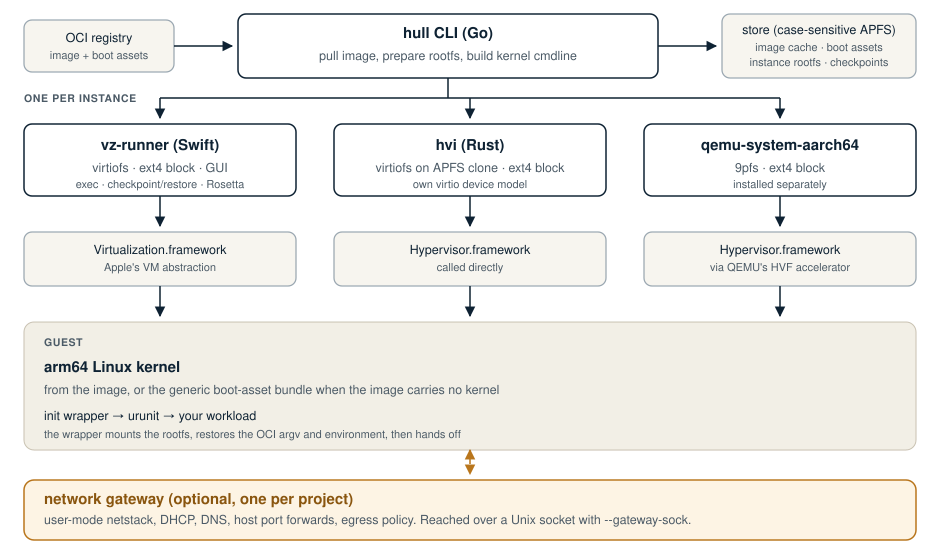

<p align="center">
  <picture>
    <source media="(prefers-color-scheme: dark)" srcset="assets/hull-lockup-on-dark.svg">
    
  </picture>
</p>

<p align="center">
  <a href="https://github.com/brig-sh/hull/releases/latest"></a>
  <a href="https://github.com/brig-sh/hull/actions/workflows/ci.yml"></a>
  <a href="https://codecov.io/gh/brig-sh/hull"></a>
  <a href="go.mod"></a>
  <a href="LICENSE"></a>
</p>

**hull boots an OCI image as a real virtual machine on an Apple Silicon Mac.**

You give it an image reference. It pulls the image, prepares a root filesystem,
picks a kernel, and starts a VM with one of three hypervisor backends. The
workload inside gets its own kernel and its own memory, not a shared one.

hull is the microVM runtime that [brig](https://github.com/brig-sh/brig) drives
on macOS. It also works on its own as a CLI.

Two kinds of workload run here, and the difference matters:

- **Ordinary Linux container images**, such as `ubuntu:latest`. hull supplies a
  generic arm64 Linux kernel and an init wrapper, then boots your image's
  filesystem inside the VM. Most people want this.
- **Unikernel images**, packaged with a kernel of their own. hull boots the
  kernel the image carries.

hull is not a Docker replacement. It has no daemon, no image building, no
Kubernetes integration, and it implements a subset of Compose. See
[Limitations](#limitations).

## Requirements

- An Apple Silicon Mac. There is no Intel build.
- macOS 26 (Tahoe) is the tested platform, and the only one CI runs.
  `vz-runner` declares a macOS 14 floor in `vz-runner/Package.swift`, so
  earlier versions can work. Nothing blocks them, and nothing tests them.
- About 2 GB of free disk space for the store, plus each image you pull.

## Install

```bash
brew tap brig-sh/brig
brew trust --tap brig-sh/brig   # Homebrew 6 and later refuse untrusted third-party taps
brew install --cask hull
```

The cask installs three executables side by side: `hull`, `vz-runner` and
`hvi`. hull finds the two runners next to its own path, so keep them together.

Installing brig brings hull with it, because brig depends on it.

Two optional extras: `brew install e2fsprogs` for the ext4 block rootfs mode,
and `brew install qemu` for the QEMU backend.

To check the signatures on a release before you install it, see
[docs/install.md](docs/install.md#verify-a-release). To build from source
instead, see [docs/build.md](docs/build.md).

## Quick start

This boots a stock `ubuntu:latest` and prints a line from inside the VM.

```bash
hull run --hypervisor vz ubuntu:latest /bin/echo hello-from-vz
```

Expected output, after the pull finishes:

```
hello-from-vz
```

The first run does three things that later runs skip. It creates the store at
`~/.hull/store`, which is a case-sensitive APFS volume hull makes and mounts
for you. It pulls `ubuntu:latest`. It also downloads the generic boot assets,
a kernel and an initrd, from the public OCI artifact
`ghcr.io/nofireai/hull-assets`. That pull is anonymous and needs no login.

That example needs no network inside the guest, so it does not need `--net`.
Networking is the part where the three backends differ most, so read
[docs/networking.md](docs/networking.md) before you run a server.

Now run something that stays up, and clean it up:

```bash
ID=$(hull run -d --hypervisor vz --net shared ubuntu:latest sleep 300)
hull ps
hull logs "$ID"
hull exec -t "$ID" /bin/sh -c 'cat /etc/os-release'
hull stop "$ID"
hull rm "$ID"
```

`hull rm` deletes that instance's root filesystem. It leaves the image cache
and the boot assets in the store, so the next run is fast. `hull rmi` and
`hull prune` clear the cache, and `hull store compact` returns the freed space
to the host -- the store is a sparse image that otherwise only grows. See
[docs/storage.md](docs/storage.md).

## Backends

`--hypervisor` picks the backend. Without it, hull reads the image's
`com.urunc.unikernel.hypervisor` annotation. If the image has no annotation
either, hull falls back to `qemu`, which is not installed by default and cannot
boot a plain container image. **Pass `--hypervisor` explicitly.**

Three backends exist. They are not equivalent, and the gaps are real:

| | `vz` | `hvi` | `qemu` |
|---|---|---|---|
| Framework | Virtualization.framework | Hypervisor.framework, called directly | Hypervisor.framework, through QEMU's HVF accelerator |
| Ships with hull | yes, as `vz-runner` | yes, as `hvi` | no, `brew install qemu` |
| Rootfs modes | virtiofs, ext4 block | virtiofs on an APFS clone, ext4 block | 9pfs, ext4 block |
| Boots a plain image with no kernel | yes | yes | **no** |
| `--net shared` | NAT, works with no extra privilege | **no TCP egress**, see below | vmnet, needs root or a QEMU signed for `com.apple.vm.networking` |
| `--gateway-sock` | yes | yes | yes |
| `exec` | yes | yes | yes |
| Checkpoint and restore | yes, with a block rootfs | no | no |
| GUI window, Rosetta | yes | no | no |

**The `hvi` networking gap is the one to know.** With `--net shared`, hvi's
built-in stack answers ARP, ICMP, DHCP and DNS, but it does not forward TCP.
A guest gets an address and resolves names, and then cannot connect to
anything. For real egress on hvi, use the network gateway. hvi's own
documentation lists this under its known limits.

`--gateway-sock` works on all three backends and needs no entitlement and no
root. Compose starts a gateway for you, one per project. That makes the gateway
the most portable way to give a guest a network.

`vz` is the default choice. It is the backend CI exercises most, and the only
one with checkpoint and restore, a GUI window, and Rosetta.
[docs/backends.md](docs/backends.md) has the full comparison.

## Architecture

<p align="center">
  <picture>
    <source media="(prefers-color-scheme: dark)" srcset="assets/architecture-on-dark.svg">
    
  </picture>
</p>

hull itself starts no VM. It prepares state and runs a separate process per
instance. [docs/architecture.md](docs/architecture.md) explains the seams.

## Limitations

- Apple Silicon only. arm64 guests only. `--platform linux/amd64` with
  `--rosetta` translates an amd64 **userspace** under Rosetta on the `vz`
  backend. The kernel stays arm64. No x86 kernel runs here.
- `hull compose` supports a subset of Compose. Unsupported keys are ignored
  with a warning on stderr. A clean `compose config` does not mean every key in
  the file is honored at runtime. [docs/compose.md](docs/compose.md) lists what
  works.
- Checkpoint and restore are `vz` only, need a block rootfs, and make no
  promise about application-level consistency. They do not move a VM to another
  host, and they cannot undo an effect the guest already sent to the outside
  world. See [docs/checkpoint-restore.md](docs/checkpoint-restore.md).
- The `vz` and `hvi` backends need a code-signing entitlement. The Homebrew
  cask ships correctly signed executables, so an installed hull needs no change
  to your Mac's security settings. If you build from source without an Apple
  signing identity, read [docs/signing.md](docs/signing.md) first.
- hull sends anonymous usage telemetry. Interactive sessions are asked for
  consent first. **Non-interactive and CI sessions are not asked, and telemetry
  stays on.** `hull telemetry off`, `--dnt` or `DO_NOT_TRACK=1` turns it off.
  [docs/telemetry.md](docs/telemetry.md) lists every field.

## Documentation

Start at [docs/README.md](docs/README.md). By task:

| I want to | Read |
|---|---|
| Install a release, or check its signature | [install.md](docs/install.md) |
| Boot a plain container image | [running.md](docs/running.md) |
| Choose a backend | [backends.md](docs/backends.md) |
| Understand what persists, and share host directories | [storage.md](docs/storage.md) |
| Give a guest a network | [networking.md](docs/networking.md) |
| Restrict what a guest can reach | [network-egress.md](docs/network-egress.md) |
| Run several services together | [compose.md](docs/compose.md) |
| Save and resume a running VM | [checkpoint-restore.md](docs/checkpoint-restore.md) |
| Look up a command, flag or environment variable | [cli.md](docs/cli.md) |
| Control image annotations and boot assets | [images.md](docs/images.md) |
| See or turn off telemetry | [telemetry.md](docs/telemetry.md) |
| Fix an error I hit | [troubleshooting.md](docs/troubleshooting.md) |
| Build from source and run the tests | [build.md](docs/build.md) |
| Sign, notarize or distribute a build | [signing.md](docs/signing.md) |
| Read the performance numbers and how they were measured | [performance.md](docs/performance.md) |
| Cut a release | [releasing.md](docs/releasing.md) |

## Contributing

Read [CONTRIBUTING.md](CONTRIBUTING.md) for commit and review conventions, and
[docs/build.md](docs/build.md) to get a build going. AI-assisted contributions
are welcome under [AI_POLICY.md](AI_POLICY.md).

Report bugs and request features through
[GitHub issues](https://github.com/brig-sh/hull/issues). For boot, console or
run-path bugs, the harnesses under [test/](test/README.md) are the usual
reproduction path.

## Built on urunc

hull is based on [urunc](https://github.com/urunc-dev/urunc), a
[CNCF](https://www.cncf.io/) Sandbox project. urunc does the hard part, running
unikernels and lightweight VMs as OCI containers, and hull carries that onto
macOS.

<p align="center">
  <a href="https://www.cncf.io/">
    
  </a>
  &nbsp;&nbsp;&nbsp;
  <a href="https://github.com/urunc-dev/urunc">
    
  </a>
</p>

hull is not a CNCF project and is not endorsed by the CNCF. The Linux
Foundation has registered trademarks and uses trademarks. For a list of trademarks of The Linux Foundation, please see our
[Trademark Usage page](https://www.linuxfoundation.org/trademark-usage).
urunc, CNCF and the CNCF logo are trademarks of The Linux Foundation.

## License

[Apache License 2.0](LICENSE)

---

<p align="center">
  <a href="https://nofire.ai">
    <picture>
      <source media="(prefers-color-scheme: dark)" srcset="assets/nofire-logo-on-dark.svg">
      
    </picture>
  </a>
</p>

<p align="center">Powered by <a href="https://nofire.ai">NOFire AI</a></p>
